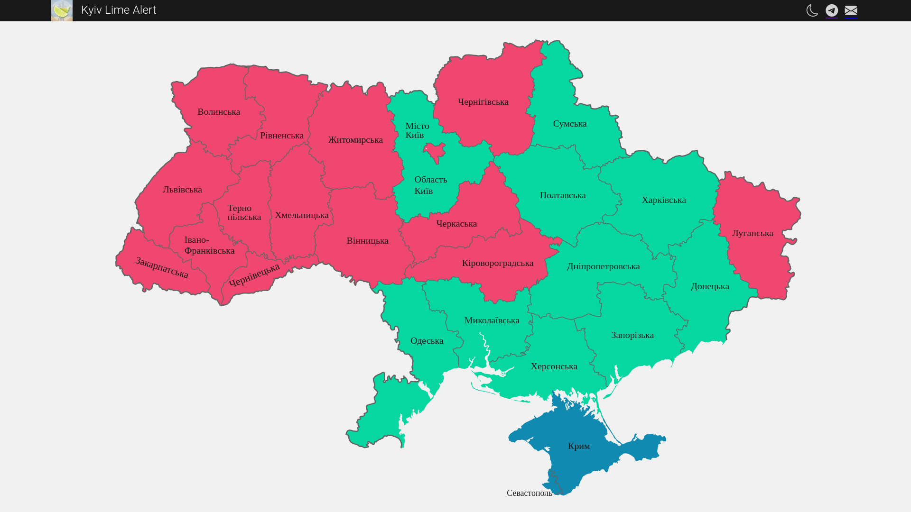

<p align="center">
	
	<br><br>
	<h1 align="center">
		Kyiv Lime Alerts Map
		<p></p>
		
		
		
		
		
		
	</h1>
	<h2 align="center">:ukraine: Мапа повітряних тривог України від проєкту <b>Київ Лайм</b> :ukraine:</h2>
<hr>
</p>

<p></p>

# :page_facing_up: Опис

### :calendar: 24 лютого 2022 року в Україні розпочалась війна.
### :rocket: За час повномаштабного російського вторгнення від ворожих ракетних обстрілів постраждало та загинуло багато людей.
### :rotating_light: Задля попереджень про можливі ракетні обстріли ми пропонуємо Вам свою мапу.

<br>

# :memo: Версії

### :heavy_check_mark: `Остання версія`
## **Версія v1.0.1**

### Додано
- *[Налаштування](.github/dependabot.yml)* для Dependabot
- *[Шаблон](.github/PULL_REQUEST_TEMPLATE/main.md)* для *Pull Request*

### Виправлено
- Перекладено текст *[ліцензії](LICENSE)*
- Перекладено текст *[кодексу поведінки](CODE_OF_CONDUCT.md)*
- Оновлено загальні положення у *[внесення вкладу](CONTRIBUTING.md)*
- Змінено основний колір у *[browserconfig.xml](browserconfig.xml)*
- Змінено посилання на підтримку через *[Issuehunt](.github/FUNDING.yml)*
- Оновлено *[шаблон](.github/ISSUE_TEMPLATE/------------------------.md)* повідомлення про помилку

<br>

## **Версія v1.0.0**

### Додано
- Темна тема
- Оновлення даних що 5 секунд
- Зручна мапа з назвами областей

### Виправлено
#### `Виправлення відсутні`

<br>

### Передперегляд доступний тут: *https://map.kyivlime.pp.ua*

<br>

```py
	Автор: @GORAlexComp
	Telegram: t.me/kyivlime
```